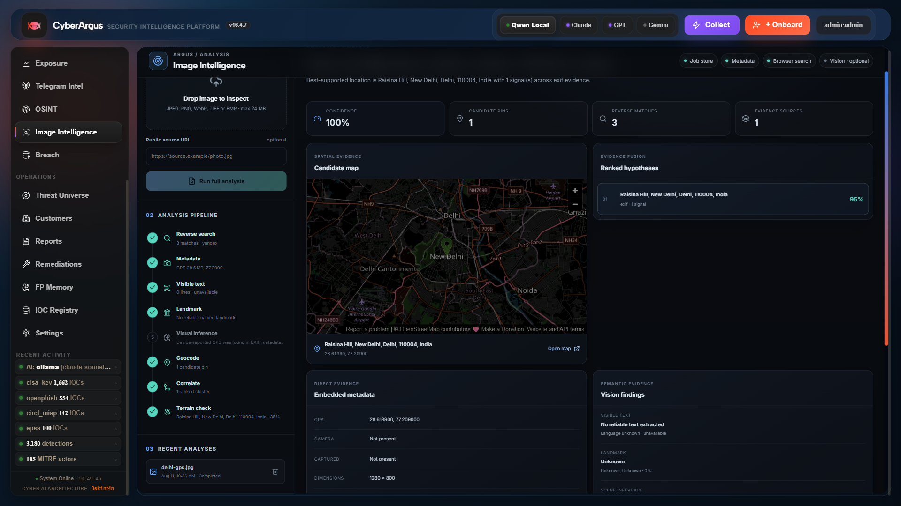
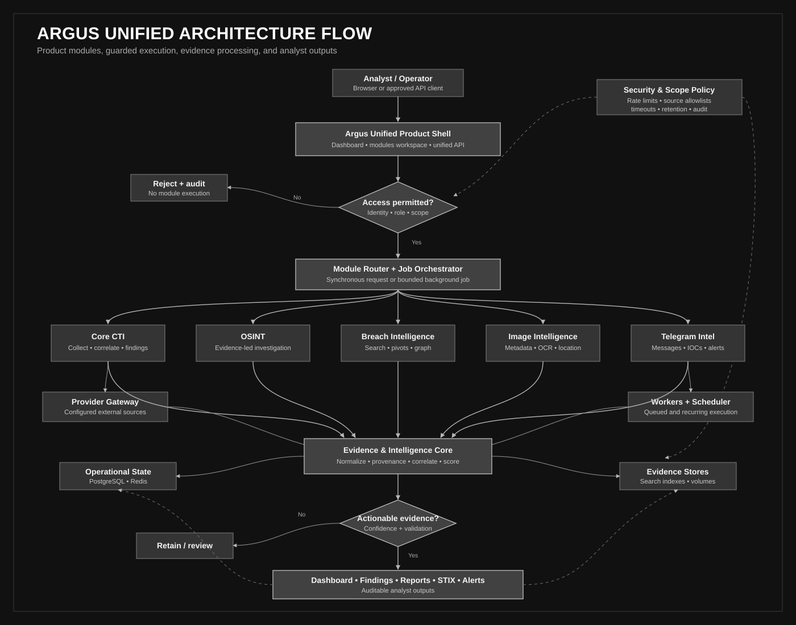
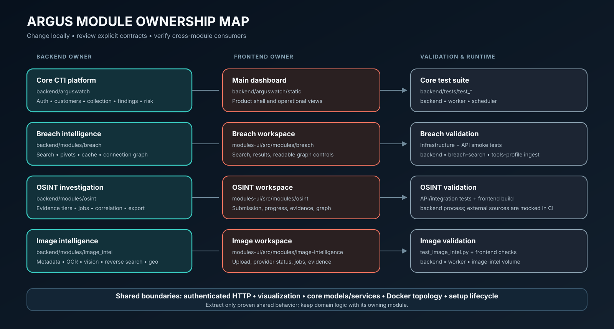
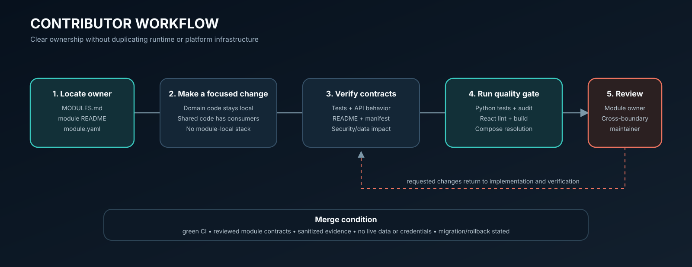

<p align="center">
  
</p>

<h1 align="center">CyberArgus</h1>

<p align="center">
  A self-hosted, authorization-scoped threat-intelligence and investigation platform.<br>
  One product shell. Clear module ownership. One reproducible application image.
</p>

<p align="center">
  
  
  
  
  
</p>

Argus Unified keeps the original `argus_main` dashboard and operational model as
the product foundation. Breach intelligence, OSINT, image intelligence, Telegram
intelligence, provider collection, scoped reconnaissance, customer-asset
correlation, exposure scoring, findings, remediation, reports, and STIX output
run behind the same authenticated application boundary.

> [!IMPORTANT]
> Use Argus only for assets, accounts, channels, sources, and datasets you are
> authorized to investigate. This repository does not include a breach corpus,
> customer data, provider credentials, or Telegram sessions.

## What is implemented

| Capability | Implemented behavior | Owner |
|---|---|---|
| Core CTI | Collection, normalization, provenance, matching, exposure scoring, findings, campaigns, remediation, reporting, and optional AI assistance | [`backend/arguswatch`](backend/arguswatch/README.md) |
| Breach intelligence | Parameterized ClickHouse search, Elasticsearch pivots, Redis caching, and bounded entity-connection traversal | [`backend/modules/breach`](backend/modules/breach/README.md) |
| OSINT | Subject investigation, site verification, calibrated evidence tiers, resumable controls, correlation, and export | [`backend/modules/osint`](backend/modules/osint/README.md) |
| Image intelligence | Safe image acquisition, metadata, OCR, vision, reverse search, geocoding/satellite adapters, evidence correlation, and persisted jobs | [`backend/modules/image_intel`](backend/modules/image_intel/README.md) |
| Telegram intelligence | Authorized collection/import, deterministic classification, IOC extraction, alerts, graphs, and STIX export | [`backend/modules/telegram_intel`](backend/modules/telegram_intel/README.md) |
| Provider gateway | Centralized configured-provider collection, enrichment, discovery, and status reporting | [`intel-proxy`](intel-proxy/README.md) |
| Scoped recon | Customer-bound reconnaissance with unscoped execution disabled by default | [`recon-engine`](recon-engine/README.md) |

<details>
<summary><strong>Product view — Image Intelligence investigation</strong></summary>
<br>

</details>

## Architecture



The repository builds one custom `argus-unified` image and runs it under separate
API, worker, scheduler, breach-search, provider-proxy, recon, and ingestion roles.
PostgreSQL, Redis, ClickHouse, Elasticsearch, and optional infrastructure remain
separate official images so persistence, upgrades, health checks, and recovery
retain correct operational boundaries.

Read the [architecture guide](docs/development/architecture.md),
[module ownership map](MODULES.md), and
[module contract](docs/development/module-contract.md) before changing a shared
interface.

## Repository map

```text
argus_unified/
|-- backend/
|   |-- arguswatch/                 Core product and shared platform
|   |-- modules/                    Independently owned domain modules
|   `-- tests/                      Backend unit, integration, and smoke tests
|-- modules-ui/src/
|   |-- modules/                    Breach, OSINT, and image workspaces
|   `-- shared/                     Authenticated HTTP, state, visualization
|-- intel-proxy/                    Provider gateway service
|-- recon-engine/                   Scope-validated recon service
|-- docker/                         Single image and Compose topology
|-- setup/                          Setup, daily lifecycle, update, and test commands
|-- initdb/ & clickhouse-init/      Idempotent datastore initialization
|-- config/                         Prometheus and operational policies
|-- docs/                           Developer guides, reports, diagrams, and assets
`-- .github/                        CI, publishing, issue routing, and PR policy
```



## Quick start on Windows

Requirements: Docker Desktop using Linux containers, Docker Compose v2, and at
least 8 GiB RAM. Python 3.12 and Node.js 22 are needed only for host-side tests
and the source-only update workflow.

```powershell
# First installation: creates .env secrets, prepares images, and builds Argus.
.\setup\setup.ps1

# Normal daily start: never pulls and never rebuilds.
.\setup\start.ps1
```

Open [http://127.0.0.1:7777](http://127.0.0.1:7777). The React investigation
workspaces are served at `/modules` by the same product endpoint.

Command Prompt users can run the matching BAT wrappers:

```bat
setup\setup.bat
setup\start.bat
```

### Daily development lifecycle

| Action | PowerShell | What it changes |
|---|---|---|
| Start | `setup/start.ps1` | Starts existing containers; no pull/build |
| Stop | `setup/stop.ps1` | Stops containers; preserves images and volumes |
| Load code changes | `setup/update.ps1` | Builds the UI locally, syncs backend/frontend, restarts only app roles |
| Rebuild immutable image | `setup/rebuild.ps1` | Uses Docker cache; required for dependency/Dockerfile changes |
| Run quality gate | `setup/test.ps1` | Tests, audits, frontend checks, Compose validation |
| Delete runtime state | `setup/fresh-start.ps1` | Destructive; requires an exact confirmation phrase |

See the complete [operations guide](docs/development/operations.md) and
[`setup/README.md`](setup/README.md). Use `update`, not `rebuild`, for ordinary
backend and frontend source changes.

## Local data and providers

Copy `.env.example` to `.env` only if the setup script has not already created
it. Keep authentication enabled and replace every required placeholder with a
unique secret. Provider keys are optional; Argus reports unavailable providers
instead of inventing results.

Place an authorized CSV corpus in ignored `data/breach/` or set
`BREACH_DATA_PATH`, then import it explicitly:

```powershell
docker compose --project-directory . -f docker/docker-compose.yml --profile tools run --rm breach-ingest
```

Live Telegram collection additionally requires an authorized account and an
explicit `TELEGRAM_CHANNELS` allowlist. Historical import and stateless analysis
do not require a live session. See the
[Telegram module guide](backend/modules/telegram_intel/README.md).

## Development

Install host-side development dependencies once, then run the same gate used by
GitHub Actions:

```powershell
.\setup\test.ps1 -Install
.\setup\test.ps1
```



Before opening a pull request:

1. Start from [MODULES.md](MODULES.md) and keep the change in its owning boundary.
2. Add focused tests and update the module README/manifest when contracts change.
3. Run the quality gate and attach sanitized visual evidence for UI work.
4. Describe authorization, network, data, migration, and rollback impact.

Read [CONTRIBUTING.md](CONTRIBUTING.md), the
[testing guide](docs/development/testing.md), and the pull request template.

## Security and production boundary

The default application bind is loopback-only. A production operator must add a
reviewed TLS ingress or VPN, preserve authentication and role checks, restrict
origin/proxy settings, configure backups and retention, validate provider legal
authority, and test restore procedures. Datastores and private services are not
published to the host by default.

Report vulnerabilities privately according to [SECURITY.md](SECURITY.md). Never
place sensitive evidence in a public issue.

## Documentation

The [documentation index](docs/README.md) links architecture and operations
guides, module-specific Word reports, mathematical methods, market comparisons,
and the black-and-white implementation flowcharts. Claims are limited to behavior
present in this codebase; known limitations are stated explicitly.

## License

Released under the [MIT License](LICENSE).
