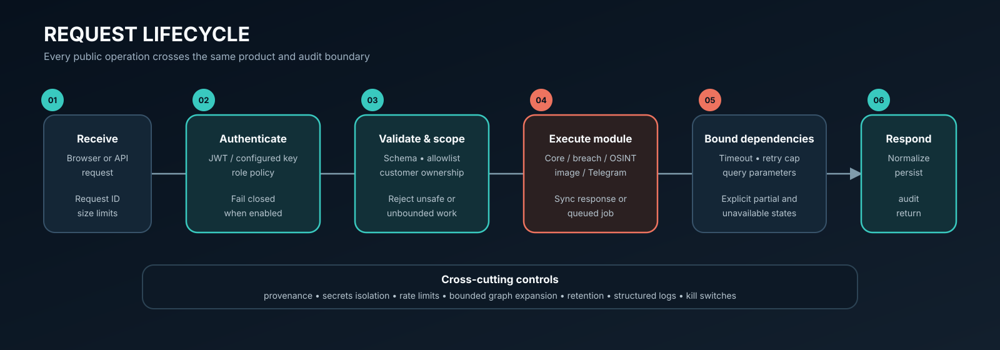

# Architecture

Argus Unified is a modular monolith at the product/API layer with independently
supervised process roles for expensive or specialized workloads. One immutable
application image supplies every Argus-owned role. Official datastore images
remain separate for persistence, upgrades, health checks, and recovery.

## Request boundary

The backend on port 7777 is the only host-published application endpoint. It
serves the main dashboard, the React modules workspace, core APIs, and
authenticated adapters to private services. The breach search, provider proxy,
recon engine, databases, and workers are reachable only on the Compose network.

## Process roles

| Role | Entry point | Purpose |
|---|---|---|
| `backend` | `arguswatch.scripts.start_api` | Web UI, auth, core API, module adapters |
| `celery-worker` | `arguswatch.celery_app` | Background collection and image processing |
| `celery-beat` | `arguswatch.celery_app` | Scheduled work dispatch |
| `breach-search` | `modules.breach.search_engine.main:app` | Authorized corpus search and graph traversal |
| `breach-ingest` | `backend/ingest.py` | Explicit operator-run corpus import |
| `intel-proxy` | `proxy_server:app` | Provider credential and collection boundary |
| `recon-engine` | `recon_server:app` | Customer-scope-validated reconnaissance |

## Trust boundaries

1. The analyst browser is untrusted input. Authentication, authorization, size
   limits, and validation execute at the unified backend.
2. Private application services trust only calls within the Compose network but
   still validate parameters; breach search also requires an internal API key.
3. External sources and providers are untrusted. Collectors enforce timeouts,
   bounded responses, provenance, and scope rules.
4. Datastores persist sensitive intelligence. They have no host-published ports
   in the default topology.

## Current limitations

- OSINT asynchronous job state is process-local and is lost when the backend
  restarts.
- Optional provider results depend on operator credentials, quotas, network
  access, and source availability.
- A production deployment still requires an operator-managed TLS ingress,
  backup/restore process, retention policy, and monitoring policy.
